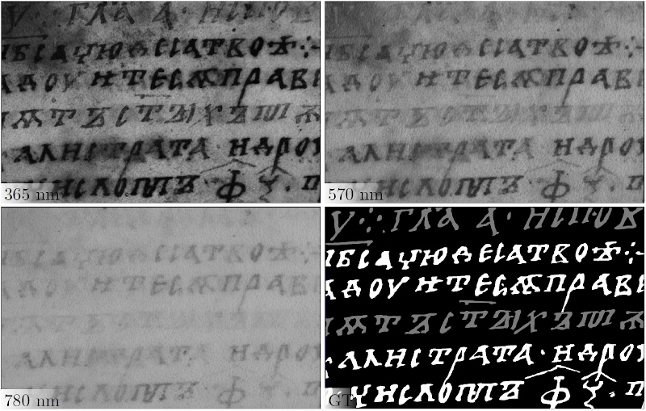

# MSBin Dataset

This dataset is named _MSBin_ which stands for MultiSpectral Document Binarization. The dataset is dedicated to the (document image) binarization of multispectral images. The dataset is introduced in [[Hollaus et al. 2019]](#[Hollaus-et-al.-2019]).



## Download
The dataset is on Zenodo:

[](https://doi.org/10.5281/zenodo.3257366)

Note that this is the second version of the dataset, where 10 images are removed from the test set, because they were too varying from the training set. The results obtained on the first version can be found in  [[Hollaus et al. 2019]](#[Hollaus-et-al.-2019]).

## Folder structure

    ├── train                   # Training set
    │   ├── images              # Input images
    │   ├── labels              # Ground-truth encoding three classes
    │   └── dibco_labels        # Ground-truth according to DIBCO scheme
    │       ├── fg_1            # Foreground 1 (main foreground) 
    │       └── fg_2            # Foreground 2 (red ink)
    ├── test                   # Training set
    │   ├── images              # Test images
    │   ├── labels              # Ground-truth encoding three classes
    │   └── dibco_labels        # Ground-truth according to DIBCO scheme
    │       ├── fg_1            # Foreground 1 (main foreground) 
    │       └── fg_2            # Foreground 2 (red ink)    

The encoding for the ground-truth images in the _labels_ folders is detailed below.
The encoding in the _dibco_labels_ folders follows the _DIBCO_ [[Pratikakis et al. 2019]](#[Pratikakis-et-al.-2019]) convention: Black is foreground and white is background. Additionally, the weights for Pseudo-Recall and Pseudo-Precision [[Pratikakis et al. 2019]](#[Pratikakis-et-al.-2019] are included in these folders.


## Usage

File:
```binar_eval.py```

```bash
usage: binar_eval.py [-h] [-dt] [--path_dibco_bin [PATH_DIBCO_BIN]]
                     [-fg_type [FG_TYPE]] [-s] [-f] [-i]
                     path_gt path_img path_csv

positional arguments:
  path_gt               path to the ground truth images
  path_img              path to the result images
  path_csv              path to the csv output file

optional arguments:
  -h, --help            show this help message and exit
  -dt, --dibco_tool     use dibco tool
  --path_dibco_bin [PATH_DIBCO_BIN]
  -fg_type [FG_TYPE]
  -s, --subfolders      evaluate subfolders
  -f, --file_results    save results for each file
  -i, --invert_imgs     invert input images
```
The files in ``path_gt`` and ``path_img`` must have the same names (for example: BT_0.png).

<!-- TODO: Examples -->
### Example usage:
The following two examples show the evaluation using our own evaluation script for F-Measure (f_measure.py).

- Evaluation of _FG_1_. Uncertain regions are masked out.

```bash
python binar_eval.py path_to_msbin/test/labels path_to_results path_to_results/results.csv -fg_type=1
```

- Evaluation of _FG_2_. Uncertain regions are masked out.

```bash
python binar_eval.py path_to_msbin/test/labels path_to_results path_to_results/results.csv -fg_type=2
```
The following example demonstrates the evaluation using _DIBCO_metrics.exe_, which can be downloaded from [DIBCO 2019 website](https://vc.ee.duth.gr/dibco2019/).
- First the resulting images must be converted to meet the _DIBCO_ requirements, here it is done for the _FG_1_ class:
```bash
python converter.py path_to_results_input path_to_results_output --msbin_path_gt=path_to_msbin/test/labels -fg_type=1
```
- Second call the eval script and tell it to use the _DIBCO_metrics.exe_ for evaluation.
```bash
python binar_eval.py path_to_msbin/test/labels path_to_results path_to_results/results.csv -fg_type=1 -dt 
```
The example above assumes that the _DIBCO_metrics.exe_ is located in the same folder as ```binar_eval.py```. If this is not the case you can pass the path with the _path_dibco_bin_ argument.


## Naming Convention
The folders containing the training and test data contain subdirectories named _images_ and _labels_. The multispectral images contained in the _images_ folder are named with the following naming convention, whereby an underscore separates the different elements:

``
BookId_PageId_WavelengthId.png
``

whereby ``BookId`` describes the type of manuscript and is either _EA_ or _BT_. ``PageId`` is a digit, which can be mapped to a certain page in the corresponding book. ``WavelengthId`` is also a number that depicts the spectral range at which the image was acquired.

The mapping is provided in the following table, together with the exposure time that was used for the certain spectral ranges.


| ``WavelengthId``        | Illumination / Spectral Range           | Exposure time (in sec.)  |
| -------------: |:-------------:| -----|
| 0  | White light (broadband)           | 0.0666 |
| 1  | 365 nm (UV flurorescence)   | 10 |
| 2  | 450 nm (narrowband)               | 0.125 |
| 3  | 465 nm (narrowband)               | 0.1 |
| 4  | 505 nm (narrowband)               | 0.05 |
| 5  | 535 nm (narrowband)               | 0.0666 |
| 6  | 570 nm (narrowband)               | 0.1666 |
| 7  | 625 nm (narrowband)               | 0.0333 |
| 8  | 700 nm (narrowband)               | 0.1666 |
| 9  | 780 nm (narrowband)               | 0.2 |
| 10 | 780 nm (narrowband)               | 0.2 |
| 11 | 870 nm (narrowband)               | 0.5 |

For the ground truth images contained in the _labels_ folder, the following naming convention is used:

``
BookId_PageId.png
``

## Imaged Books
The dataset is comprised of 120 image portions, whereby the training and test sets contain 80 and 40 multispectral images, respectively. 
The portions are taken from two medieval manuscripts, named _Bitola-Triodion ABAN 38_ (hereafter named _BT_) and _Enina-Apostolus NBMK 1144_ (hereafter named _EA_). 
The latter one is in a worse condition than the first one, since it contains partially damaged folios and faded-out ink. 
Each multispectral image in the dataset has been taken from a different manuscript folio.

## Classes
Both manuscripts contain cyrillic text written in iron gall ink.
The corresponding foreground regions are colored black or brown.
This class is hereafter denoted as _FG_1_.
The document background class is abbreviated with _BG_.
Additionally, a subset of the images contain characters that are written in red ink, denoted as _FG_2_.
The test set contains certain regions that are labeled as uncertain regions _UR_ in the ground truth images. 
_UR_ denote regions, that could not be clearly identified as belonging to _FG_1_, _FG_2__ or _BG_.
These regions are excluded from the evaluation:
Therefore, in the evaluation they are marked as belonging to the background - both in the ground truth images as well as in the resulting images.
The training set does not contain uncertain regions, in order to allow for a training on entire image patches.

## Groundtruth
The ground truth contains a color-coded image for each multispectral image, whereby the colors encode different classes - as listed in the following table.

| Label        | Description           | RGB color code  |
| ------------- |:-------------:| -----:|
| _FG_1_  | Main text         | (255, 255, 255) |
| _FG_2_ | Red ink           | (122, 122, 122) |
| _BG_  | Background        | (0, 0, 0)       |
| _UR_  | Uncertain region  | (0, 0, 255)     |

## Results
Numerical results gained within my PhD thesis. Once it is published, I will link it here.
### Training set:

| Method        | FM    | p-FM  | PSNR  | DRD   |
| ------------- |:-----:| -----:|:-----:| -----:|
| ACE v1 [[Hollaus et al. 2015]](#[Hollaus-et-al.-2015])  | 87.66 | 87.75 | 14.27 | 13.04 |
| ACE v2 [[Diem et al. 2016]](#[Diem-et-al.-2016])        | 87.54 | 87.83 | 14.35 | 13.53 |
| GMM [[Hollaus et al. 2018]](#[Hollaus-et-al.-2018])     | 86.80 | 86.94 | 14.05 | 13.39 |
| FCN [[Hollaus et al. 2019]](#[Hollaus-et-al.-2019])     | 92.15 | 94.24 | 15.97 | 6.87 |

### Test set:

| Method        | FM    | p-FM  | PSNR  | DRD   |
| ------------- |:-----:| -----:|:-----:| -----:|
| ACE v1 [[Hollaus et al. 2015]](#[Hollaus-et-al.-2015])  | 81.28 | 81.18 | 13.28 | 22.03 |
| ACE v2 [[Diem et al. 2016]](#[Diem-et-al.-2016])        | 81.25 | 81.36 | 13.27 | 20.80 |
| GMM [[Hollaus et al. 2018]](#[Hollaus-et-al.-2018])     | 80.00 | 80.28 | 13.18 | 20.35 |
| FCN [[Hollaus et al. 2019]](#[Hollaus-et-al.-2019])     | 89.39 | 90.89 | 15.17 | 9.91 |

## Image Acquisition

The image acquisition was fulfilled in the course of the [CIMA (Centre of Image and Material Analysis in Cultural Heritage)](https://cima.or.at) project.

The images contained in the _MSBin_ dataset have been captured with a Phase One IQ260 achromatic camera with a resolution of 60 megapixels. 
A multispectral LED panel provides 11 different narrow-band spectral ranges from 365 nm until 940 nm. 
An UltraViolet (UV) long pass filter has been used in combination with UV light (365 nm) to acquire UV fluorescence images.
For the acquisition of the remaining 10 spectral ranges no optical filter has been used.
Additionally, a broadband LED illumination has been used to acquire white light images.
Therefore, each multispectral image consists of 12 channels.

For each spectral range an individual exposure time has been determined in order to maximize the spectral range. 
These individual exposure times for the spectral ranges remained unchanged during the acquisition, because otherwise the spectral variability of the target classes would have been increased.
The images have been registered onto each other with a multimodal image registration algorithm
[[Heinrich et al. 2012]](#[heinrich-et-al.-2012]), in order to correct optical distortions.


## References
### [Hollaus et al. 2019]
F. Hollaus, S. Brenner and R. Sablatnig: "CNN based Binarization of MultiSpectral Document Images". To appear in: International Conference on Document Analysis and Recognition (ICDAR), 2019.
### [Heinrich et al. 2012]
M. P. Heinrich, M. Jenkinson, M. Bhushan, T. Matin, F. V. Gleeson, S. M. Brady, and J. A. Schnabel, “MIND: Modality independent neighbourhood descriptor for multi-modal deformable
registration”. Medical Image Analysis, vol. 16, no. 7, pp. 1423–1435, 2012
### [Pratikakis et al. 2019]
Ioannis Pratikakis, Konstantinos Zagoris, Xenofon Karagiannis, Lazaros T. Tsochatzidis, Tanmoy Mondal, Isabelle Marthot-Santaniello:
ICDAR 2019 Competition on Document Image Binarization (DIBCO 2019). ICDAR 2019: 1547-1556
### [Hollaus et al. 2015]
Fabian Hollaus, Markus Diem, Robert Sablatnig:
Binarization of MultiSpectral Document Images. CAIP (2) 2015: 109-120
### [Diem et al. 2016]
Markus Diem, Fabian Hollaus, Robert Sablatnig:
MSIO: MultiSpectral Document Image BinarizatIOn. DAS 2016: 84-89
### [Hollaus et al. 2018]
Fabian Hollaus, Markus Diem, Robert Sablatnig:
MultiSpectral Image Binarization using GMMs. ICFHR 2018: 570-575